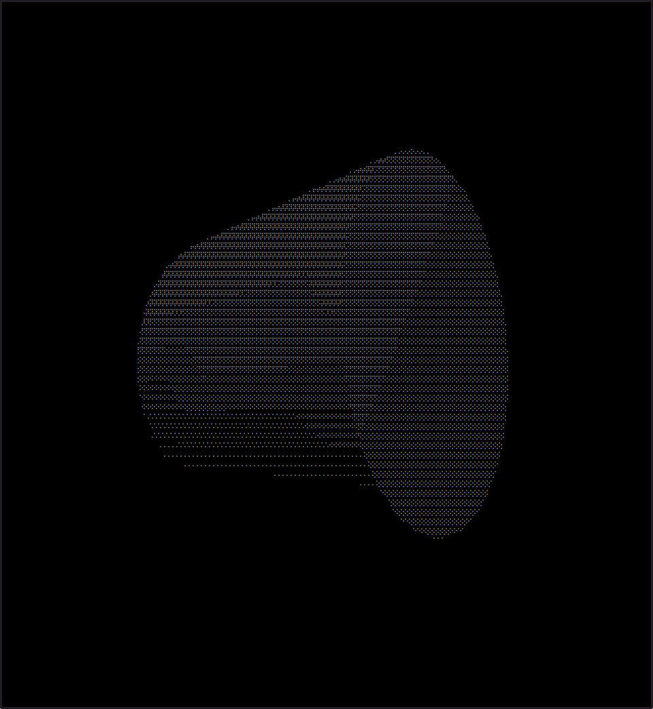
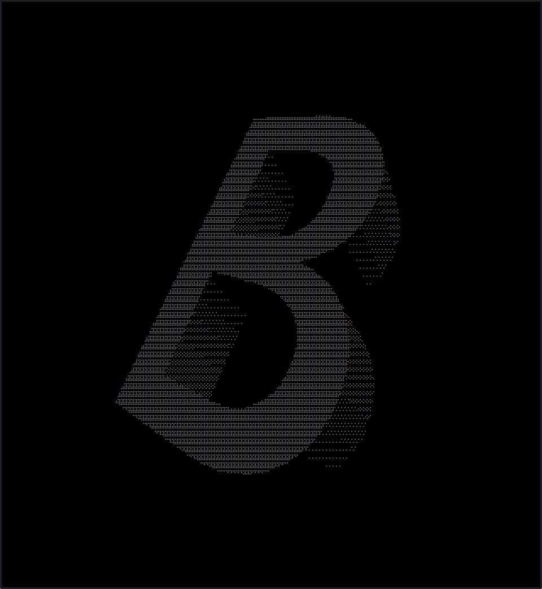
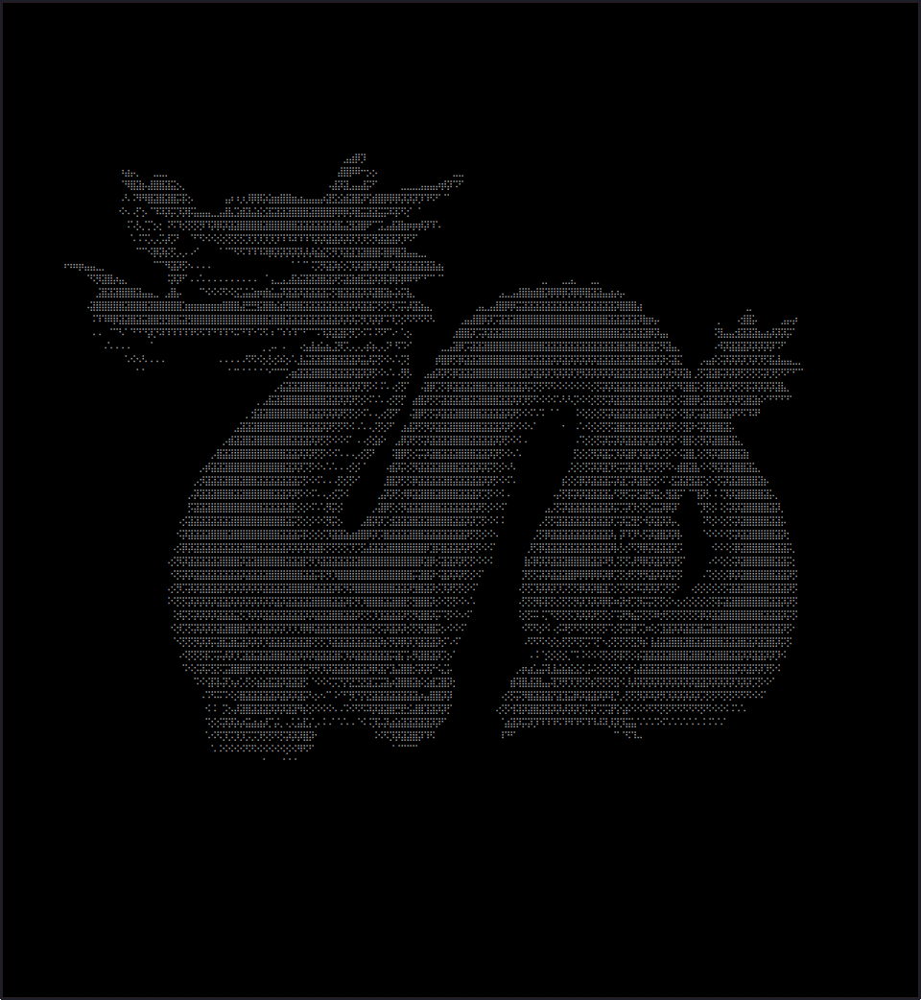

# BrailleEngine
## What is it? 
Braille Engine is an NCurses Linux application that uses unicode braille characters to display 3D objects. \
This repository uses modified code from the [RenderEngine](https://github.com/youngbrycecode/RenderEngine) tutorial repository. 
## Requirements
- A terminal that supports unicode characters. 
## Dependencies
### Debian-based Distributions
``apt install libncursesw5-dev``
## Instructions
- Compile using ``make``.
- Run using ``./all``.
- Exit using ctrl-c.
- To change the 3D model, edit the ``MODEL_PATH`` string in ``main.cpp``. 
## To do
- Fix occasional flickering / black screen. 
- Fix subtle see-through effect with hollow objects (caused by simplified logic). 
## References
- [NCurses 3D Render Engine Tutorial Series](https://www.youtube.com/playlist?list=PLg4mWef4l7Qzxs_Fa2DrgZeJKAbG3b7ue). 
## Pictures
 \
 \
 
